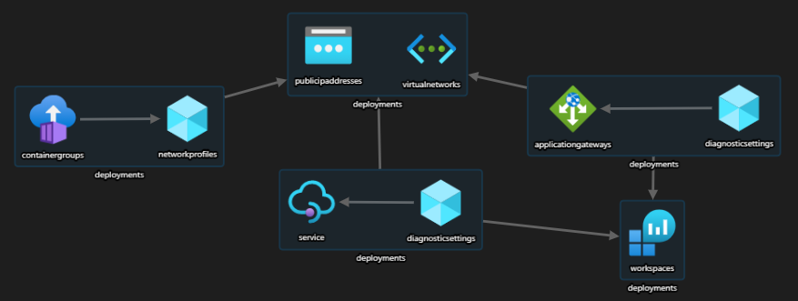

# bicep-appgw-apim
Deploy Azure Application Gateway and Azure API Management using Bicep DSL.

## scenario
In this exercise I took an ARM template created years ago and I migrated it to BICEP adding few changes like the introduction of the user-assigned managed identity to fetch the SSL certificates from Azure KeyVault and Azure Container Instances as a jumpbox.

This kind of infrastructure is commonly used to segregate internal and external API traffic and to enforce L4 (VNET + NSG) and L7 (WAF + APIM) protection.


## prerequisites
Certificates must be created upfront and loaded in KeyVault. Prerequisites are described [here](Prerequisites.md).

## deploy
```
 az deployment group create -f ./00main.bicep -g $rgname -p environment=dev -p uamsi=12345678-1234-1234-1234-123456789012
```
result of the deployment.


## about BICEP

PROs
- It's easy to start, it reduces the complexity of the ARM template. You can have your comments and place the variables close to the objects they belong to.
- the 'build' command is helpful during the development. ```bicep build .\filename.bicep``` 
- the ```decompile``` command can speed up the bicep development.
- bicep allows to break down the ARM complexity by defining MODULES. For every module a 'Microsoft.Resources/deployments' resource will be created in the output ARM template.



- bicep structure and syntax https://docs.microsoft.com/en-us/azure/azure-resource-manager/templates/bicep-file


CONs
- consider to wait the v4 before starting a new project with bicep (https://github.com/Azure/bicep/issues/1852)
- compared to ARM templates BICEP is less verbose but still titghly coupled to arm structure (the bicep file for appgw can be quite big see [here](https://docs.microsoft.com/en-us/azure/templates/microsoft.network/applicationgateways?tabs=bicep)) 
- referencing child can be complex (https://github.com/Azure/bicep/issues/127) and it's still under review (https://github.com/Azure/bicep/issues/2245)

